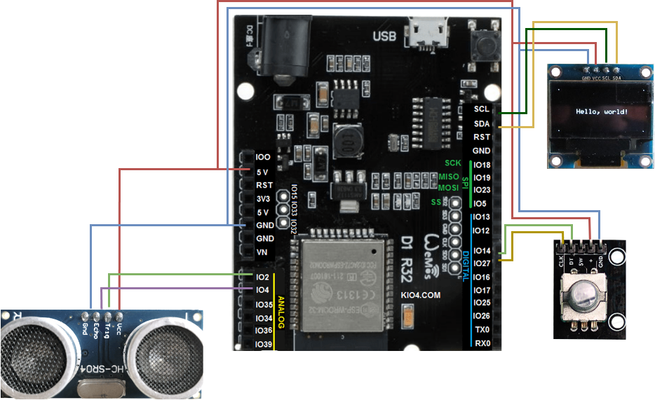

# ESP32 - Měření vzdálenosti ultrazvukovým senzorem

## Projekt do předmětu [NAV](https://www.fit.vut.cz/study/course/NAV/.cs), VUT FIT 2023

autor: Daniel Pátek (xpatek08@stud.fit.vutbr.cz)

### Úvod

Cílem projektu je navrhnout a realizovat vestavěný systém pro měření vzdálenosti pomocí ultrazvukového senzoru. Součástí řešení je správné zapojení obvodu a naprogramování mikrokontroleru `Wemos D1 R32 UNO` s čipem `ESP32`. Naměřená vzdálenost bude zobrazena na OLED displej a rotační enkodér bude použit k ovládání četnosti měření, tedy ke kontrole prodlení mezi jednotlivými měřeními.

### Obvodové zapojení



### Implementace

V samotném kódu jsou nejprve jsou načteny potřebné knihovny pro displej a senzory. Následně jsou definovány piny pro senzory a proměnné pro ovládání zpoždění a debouncingu. V `setup` funkci jsou inicializovány senzory a nastavena počáteční pozice enkodéru. Dále je registrována interrupční rutina pro ovládání enkodéru. V `loop` funkci jsou vzdálenosti zobrazeny na displeji a posílány do sériového portu. Kromě toho je zde ovládání zpoždění pomocí enkodéru a funkce `delay`. Celkově tedy tento kód umožňuje měřit vzdálenosti a měnit zpoždění mezi jednotlivými měřeními pomocí enkodéru.

### Spuštění projektu

Pro spuštění projektu je potřeba využít `Arduino IDE` alespoň ve verzi 2.1.0. Pro naprogramování desky s čipem `ESP32` je zapotřebí tuto desku přidat do seznamu podporovaných (_Additional Board Manager URLs_) pomocí následujícího odkazu:

```txt
https://raw.githubusercontent.com/espressif/arduino-esp32/gh-pages/package_esp32_index.json
```

Po instalaci balíku `ESP32` je v IDE potřeba zvolit desku `ESP32 Dev Module` a správný port pro naprogramování.
Před samotným naprogramováním desky je nezbytné doinstalovat potřebné knihovny, které jsou využity. Jmenovitě jde o následující knihovny:

```txt
Wire.h
Adafruit_GFX.h
Adafruit_SSD1306.h
VL53L0X.h
Ultrasonic.h
RotaryEncoder.h
```

### Závěr

V rámci projektu byl vytvořen funkční vestavěný systém sloužící k měření vzdálenosti pomocí ultrazvukového senzoru. V rámci řešení bylo vytvořeno demonstrační video, které ukazuje funkcionalitu systému. Video je dostupné na [serveru youtube.com](https://www.youtube.com/watch?v=FTfudZFFxM8).
